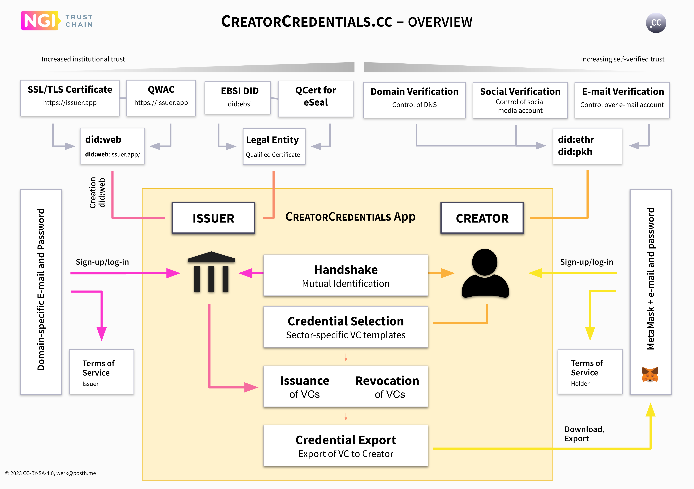

# Introduction

## Project Summary

CreatorCredentials.cc will develop a user-centric digital identity management framework specifically designed for the cultural and creative communities. This includes a software application that can be used by media organisations, membership organisations or other trust services to issue verifiable credentials to creators and other rightsholders. Creator Credentials will increase the trustworthiness of declarations and claims to digital media content online.

<figure><figcaption>
Overview
</figcaption></figure>

The app will be based on new and upcoming ISO and W3C standards for decentralised content identification (ISCC), decentralised identifiers (DIDs), and verifiable credentials (VCs). It will be aligned with European regulations on digital identity, data privacy, and copyright, ensuring that all credentials issued and verified adhere to industry regulations and safeguard self-sovereign control over user data.

The app will be developed as an open-sourced, dockerized service that can be installed on premise by media organisations. It will facilitate the onboarding process, mutual authentication, and verification of credential issuers and creators. The app will support the creation and issuance of a variety of credential types and subjects, tailored to the specific needs of the various media sectors.

CreatorCredentials.cc aims to establish a new role for public entities and organisations in digital media publishing. By extending the state-of-the-art in digital identities to the cultural and creative communities and solving existing real-world problems, the project aims to provide new and highly innovative software solutions for credential issuers and future trust services.

## Contact information

If you have any questions, please fee free to reach out:

Sebastian Posth [https://github.com/sposth](https://github.com/sposth)\
Posth Werk [https://posth.me/](https://posth.me/)

***

The development work and innovation process has been funded by European Union’s Horizon 2020 research and innovation programme under grant agreement No. 101093274

[https://trustchain.ngi.eu/creatorcredentials-cc/](https://trustchain.ngi.eu/creatorcredentials-cc/)
