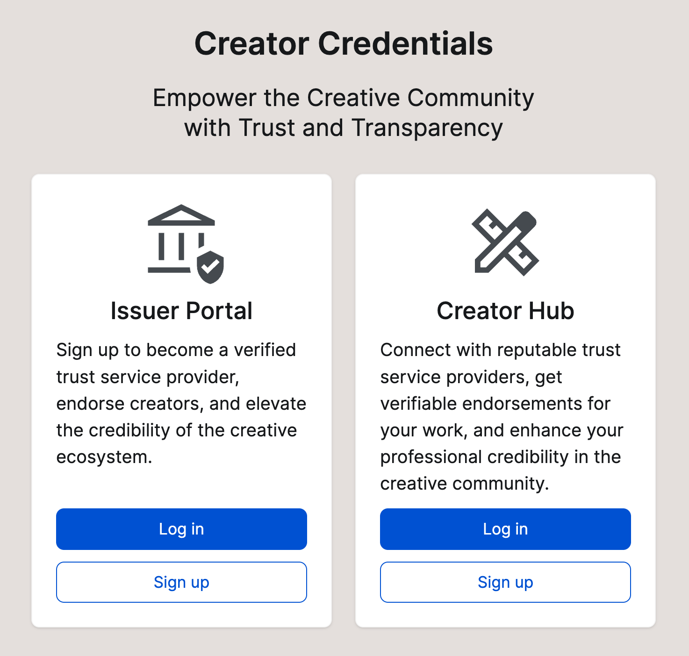

---
layout:
  title:
    visible: true
  description:
    visible: false
  tableOfContents:
    visible: true
  outline:
    visible: true
  pagination:
    visible: true
---

# The Application

<figure><figcaption>
Landing page
</figcaption></figure>

## **For Creators: Establish and Manage Your Digital Identity**

Creators can sign up and verify themselves through domain verification (DNS), proving ownership over their digital presence. Additionally, they can connect with trusted credential issuers to receive Verifiable Credentials (VCs) from recognised media stakeholders, further strengthening their digital identity.

VCs are hosted and managed in their secure wallet. These credentials remain portable, cryptographically verifiable, and interoperable, allowing creators to share them with platforms, publishers, and other third parties.

## **For Issuers: Enable Trust and Authentication in Digital Media**

Media organisations, creator associations, Collective Management Organizations (CMOs), and other industry entities can act as issuers and trust services for creators and rightsholders, issuing Verifiable Credentials (VCs) that provide secure, verifiable proof of attribution and (pseudonymous) rightsholder identites.&#x20;

Issuers establish their own authority by verifying themselves through domain verification (DNS) or setting up did:web for decentralised identity authentication. To further enhance trust, they can integrate Qualified Certificates (QCerts for eSeal) to prove their legitimacy as a fully verified and trustworthy legal entity.

As a verified issuer, they can issue VCs to creators and rightsholders, providing secure, machine-readable author attributions that reinforce credibility, transparency, and accountability in digital content. Creator organisations and Collective Management Organisations (CMOs) can e.g. issue VCs to their members, empowering them to establish trust in their claims and content declarations.

By bridging the gap between creators and trusted digital identity services, Creator Credentials ensures a transparent, verifiable, and accountable media ecosystem.

The app is based on the ISO standard for decentralised content identification (ISCC), W3C recommendations for decentralised identifiers (DIDs), and verifiable credentials (VCs). It is aligned with European regulations on digital identity (eIDAS), data privacy, and copyright, ensuring that all credentials issued and verified adhere to industry regulations and safeguard self-sovereign control over user data.

It will facilitate the onboarding process, mutual authentication, and verification of credential issuers and creators. The app will support the creation and issuance of a variety of credential types and subjects, tailored to the specific needs of the various media sectors.

## Enter the construction site

Feel free to have a look at the visual interface of the Creator Credentials app:&#x20;


CreatorCredentials.app


Be aware that the application is still in development. Not all things be fully functional, but you can certainly click through the application and get a better idea what you can do either as a creator or as a trust service (credentials issuer). &#x20;
